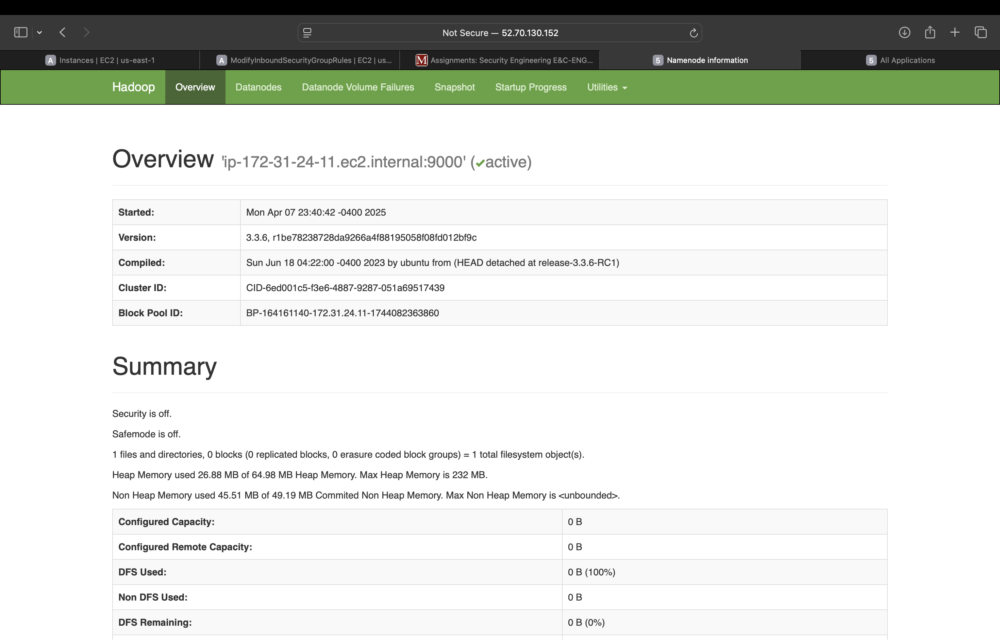

# Hadoop Project on AWS EC2

## Team Members
- Angad Deep Singh
- Poojitha Singh
- Robert Lewandowski
- Deepikaveni Venkatanarayanan

### PROJECT OVERVIEW:
##### This project demonstrates setting up a basic Hadoop cluster using EC2 instances on AWS. It includes one master and one worker node configured on Ubuntu 24.04.2 LTS with OpenJDK 11.

## Steps to run the project

### Step 1: AWS Console - Navigate to EC2 Dashboard to launch instances.
* Launch two EC2 instances.
* Use Ubuntu 24.04.2 LTS AMI.
* Assign names like HadoopMaster and HadoopWorker for clarity.

### Step 2: Launch two EC2 Ubuntu instances - one as Master and the other as Worker.
## Allow inbound rules for:
* SSH (TCP 22)
* Custom TCP (TCP 8088, 9000, 9870) – Required for Hadoop Web UIs.

### Step 3: connect via SSH
* Use the public IP address to SSH into each instance.
* Run system updates and install OpenJDK

### Step 4: Configure Hostnames and Network:

### Step 5: Allocate and Use Elastic IP
* Allocate a new elastic IP and associate it with your master node.

### Step 6: Download and Install Hadoop

### Step 7: Set Environmental Variables

### Step 8: Configure Hadoop XML Files
##### Core-site.xml

##### Hdfs-site.xml

##### Yarn-site.xml

### Step 9: Configure workers file
##### On the master node, list the private IPs of your worker nodes inside
##### $HADOOP_HOME/etc/hadoop/workers:

### Step 10: Configure Remaining Hadoop Files

##### Mapred-site.xml

### Step 11: Setup Passwordless SSH from Master to Worker

##### On master node:

##### On worker node:

### Step 12: Format NameNode & Start Services 

##### Start DFS:

##### Start YARN:

#### Results

### Conclusion:

#### This project successfully demonstrated the setup and configuration of a Hadoop cluster on AWS EC2 instances, implementing a distributed computing environment capable of processing large datasets. Through this implementation, we established:
* A functional master-worker architecture using EC2 instances
* Proper Hadoop configuration
* SSH communication between nodes
* Enviornment setup for running MapReduce jobs

## Due to teir level, worker node is off and master is running

#### The system was designed to process textual data (in this case, analyzing word frequency in books) by distributing the workload across worker nodes, showcasing Hadoop's ability to parallelize large-scale data processing tasks.

### Note on Limitations:
#### Due to AWS Free Tier restrictions, we encountered resource constraints that prevented running both master and worker nodes simultaneously for the final word count execution. However, all configuration steps were thoroughly validated, and the architecture is fully functional - with adequate resources in a non-Free Tier environment, the system would successfully:
* Distribute the book text across HDFS
* Execute the WordCount MapReduce job
* Aggregate results from worker nodes
* Produce the complete word frequency analysis

